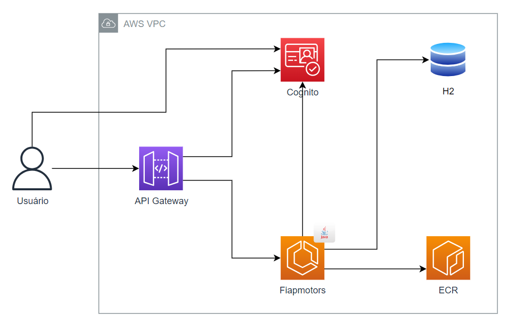

# 🚗 Fiapmotors — CRUD + Compra de Veículos
**Arquitetura Hexagonal · Spring Boot · JPA · H2 · Amazon Cognito**

Aplicação Java/Spring Boot com **arquitetura hexagonal (ports & adapters)**, **JPA/Hibernate**, **H2 em memória** e integração com **Amazon Cognito** para autenticar **apenas** a rota de compra de veículo.

 teste 

---

## 📋 Requisitos
- **Java 17**
- **Maven 3.9+**
- (opcional) **Docker**
- Postman / cURL para testar

---

## ▶️ Como rodar localmente

### 1) Clonar e subir
```bash
git clone https://github.com/vitescames/fiapmotors
cd fiapmotors
mvn spring-boot:run
```
A app sobe em: **http://localhost:8086/fiapmotors**

> Configurações relevantes (`src/main/resources/application.yml`):
> - `server.port: 8086`
> - `server.servlet.context-path: /fiapmotors`
> - H2 em memória (`jdbc:h2:mem:fiapmotors`) e `ddl-auto: update`

### 2) Console H2 (opcional)
- **URL:** `http://localhost:8086/fiapmotors/h2-ui`
- **JDBC URL:** `jdbc:h2:mem:fiapmotors`
- **User:** `sa`
- **Password:** *(vazio)*

---

## 🔗 Endpoints (locais)

> Base: `http://localhost:8086/fiapmotors`

### 👤 Cliente
- **Criar cliente**  
  `POST /cliente`  
  **Exemplo de body:**
  ```json
    {
        "nome": "Vithor",
        "idade": 27,
        "sexo": "M",
        "cpf": "12345678909",
        "senha": "123456",
        "email": "vvitescames@gmail.com"
    }
  ```

### 🚙 Veículo
- **Criar veículo**  
  `POST /veiculo`  
  **Body (exemplo):**
  ```json
    {
        "tipo": "Motocicleta",
        "marca": "Renault",
        "ano": "2025",
        "cor": "Branco",
        "preco": 2332.12
    }
  ```

- **Editar veículo (parcial)**  
  `PATCH /veiculo/{id}`  
  **Body (exemplo):**
  ```json
  {
    "preco": 82990.00
  }
  ```

- **Listar veículos vendidos**  
  `GET /veiculo?status=vendidos`

- **Listar veículos não vendidos**  
  `GET /veiculo?status=nao_vendidos`

- **Comprar veículo** *(rota protegida por token Cognito)*  
  `POST /veiculo/{id}/comprar`  
  **Sem body**. Exige header:
  ```http
  Authorization: Bearer <ACCESS_TOKEN>
  ```
  **Exemplo real:**
  ```http
  POST http://localhost:8086/fiapmotors/veiculo/0b61b130-3f40-4af4-b34c-8c82528f30fe/comprar
  Authorization: Bearer <ACCESS_TOKEN>
  ```

---

## 🔐 Autenticação com Amazon Cognito (somente na rota de compra)

Para comprar, você precisa de um **Access Token (JWT)** válido do Cognito. O token é obtido via **InitiateAuth** com o fluxo `USER_PASSWORD_AUTH`.

### Obter token com InitiateAuth (exemplo via Postman/cURL)

**Endpoint:**
```
POST https://cognito-idp.us-east-1.amazonaws.com/
```

**Headers:**
```
Content-Type: application/x-amz-json-1.1
X-Amz-Target: AWSCognitoIdentityProviderService.InitiateAuth
```

**Body (JSON):**
```json
{
  "AuthParameters" : {
    "USERNAME" : "email@gmail.com",
    "PASSWORD" : "senha"
  },
  "AuthFlow" : "USER_PASSWORD_AUTH",
  "ClientId" : "4o9bghqupqc9l2slgoflkrpr88"
}
```

**Resposta (trecho):**
```json
{
  "AuthenticationResult": {
    "AccessToken": "<TOKEN_AQUI>",
    "IdToken": "...",
    "RefreshToken": "...",
    "ExpiresIn": 3600,
    "TokenType": "Bearer"
  }
}
```

> **Use o `AccessToken`** no header `Authorization: Bearer ...` para chamar `POST /veiculo/{id}/comprar`.  
> O **`IdToken`** não deve ser usado para proteger APIs REST — ele identifica o usuário no front-end, enquanto o **Access Token** autoriza chamadas à API.

### O que é o **InitiateAuth** e por que usamos?
`InitiateAuth` é a chamada da API do Cognito que inicia o fluxo de autenticação. Com `USER_PASSWORD_AUTH`, você envia **e-mail/usuário e senha** do **User Pool** e recebe os **tokens JWT** (Access/ID/Refresh).  
Neste projeto, escolhemos esse fluxo porque:
- é simples para demos/serviços (sem Hosted UI);
- retorna o **Access Token** esperado pelo API Gateway/backend;
- permite proteger **apenas a rota de compra** de forma objetiva.

---

## 🧱 Arquitetura Hexagonal (Ports & Adapters)

- **Core (Domínio + Use Cases):** regras de negócio puras, sem dependência de frameworks; define *ports* (interfaces) de entrada/saída.
- **Adapters In:** exposição HTTP (controllers REST) mapeando requisições → use cases.
- **Adapters Out:** integrações externas (ex.: **JPA/H2** para persistência e **Cognito** para identidade).
- **Configuration:** wiring de dependências no Spring.

**Benefícios principais:** isolamento do domínio, testes fáceis, troca de tecnologia sem tocar no core (ex.: H2 → Postgres; Cognito → outro IdP).

---

## 🐳 Rodar com Docker (opcional)

### Build da imagem
```bash
docker build -t fiapmotors:local .
```

### Subir o container
```bash
docker run --rm -p 8086:8086 --name fiapmotors fiapmotors:local
```
App disponível em: `http://localhost:8086/fiapmotors`

---

## ⚡ Testes rápidos (cURL)

**Criar cliente**
```bash
curl -X POST http://localhost:8086/fiapmotors/cliente   -H "Content-Type: application/json"   -d '{
    "nome": "Vithor",
    "idade": 27,
    "sexo": "M",
    "cpf": "12345678909",
    "senha": "123456",
    "email": "email@gmail.com"
  }'
```

**Criar veículo**
```bash
curl -X POST http://localhost:8086/fiapmotors/veiculo   -H "Content-Type: application/json"   -d '{
    "tipo": "Motocicleta",
    "marca": "Renault",
    "ano": "2025",
    "cor": "Branco",
    "preco": 2332.12
}
'
```

**Editar veículo**
```bash
curl -X PATCH http://localhost:8086/fiapmotors/veiculo/<ID>   -H "Content-Type: application/json"   -d '{"preco":82990.0}'
```

**Listar vendidos**
```bash
curl "http://localhost:8086/fiapmotors/veiculo?status=vendidos"
```

**Listar não vendidos**
```bash
curl "http://localhost:8086/fiapmotors/veiculo?status=nao_vendidos"
```

**Comprar (token Cognito)**
```bash
curl -X POST http://localhost:8086/fiapmotors/veiculo/<ID>/comprar   -H "Authorization: Bearer <ACCESS_TOKEN>"
```

---

## 🧰 Troubleshooting

- **404 nas rotas** → confirme o prefixo `/fiapmotors` e o método HTTP correto.
- **401 na compra** → garanta que é **Access Token** válido (não o `IdToken`) e que não expirou.
- **500 ao criar/editar** → veja logs no console e, se desejar, acesse o **H2 Console** para inspecionar os dados.
- **H2 Console não abre** → confirme `spring.h2.console.enabled=true` e `path: /h2-ui`.

---

## 📎 Notas
- O projeto registra cliente também no **Cognito** ao criar usuário local.
- Na compra, o backend obtém o **ID do usuário (sub)** a partir do token enviado no header.
- Rota de compra não exige body; apenas o token e o `id` do veículo na URL.

---

## ❓ Dúvidas
Se quiser saber mais ou ajustar algo (Swagger/OpenAPI, ALB/API Gateway, CI/CD, JWT validation local etc.), **me chame!**
